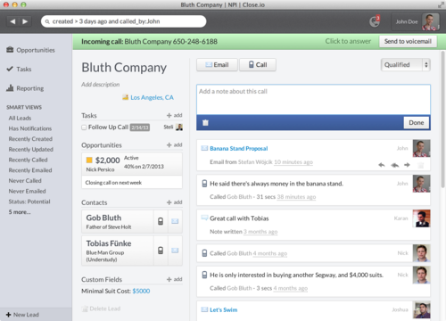

Our team had the experience of hacking on several projects together before setting out to build [Close sales communication software](https://close.com/), but when starting on this app we took some time to carefully choose our tech stack (and [the startups and services](https://blog.close.com/the-startups-and-services-behind-closeio/)) to build upon.

We needed a **very fast user interface** (our #1 goal was to create happy users), and a **scalable backend** (our customers sometimes commonly import 10k or 100k new sales leads as they start using the system).

Here’s how we’ve built it.

At its technical core, [Close](https://close.com/) is a web app wrapped in native Mac/Windows applications in order to provide a desktop experience and high quality calling functionality.

The frontend is written in JavaScript using Backbone.js, and it interacts entirely with our [public API](https://developer.close.com/) built in Python using Flask, MongoDB, and ElasticSearch.

API-based
---------

Probably the single best architectural decision we made early on is strictly enforcing that our internal app’s functionality will use the same public-facing RESTful API. This has a few benefits:

*   **The obvious.** We ended up having an extremely robust public API as a result, which allows our customers to integrate with Close in a very deep way. It’s great to be able to answer most “Can your API do _X_?” questions with “If it can be done in the UI, it can be done via the API.”
*   **Better abstraction.** By creating a public-facing API for each new feature you need, you make better decisions about how something should work—both by itself, and the big picture of your application. It might be tempting to throw up a quick non-API view that you can AJAX post to for a new feature, but you can easily end up reinventing the wheel and have multiple not-quite-the-same conventions between different parts of your application.
*   **Rely on conventions**. When working with a standardized API it’s easier to reuse code, auto-generate endpoint urls, etc. in the Backbone.js client and trust that standard REST principles apply everywhere.
*   **Investing in frameworks.** Since we had to build so much complex functionality into our API, we invested in writing frameworks that have made our lives easier in the long-run and make for happier developers since there’s very little boilerplate code in creating new resources/endpoints. And we’ve gotten to be good net citizens by open sourcing them: [Flask-MongoRest](https://github.com/closeio/flask-mongorest) & [cleancat](https://github.com/closeio/cleancat).

Frontend
--------

Close is a single-page [Backbone.js](http://backbonejs.org/) app with a few notable goals:

*   **Be really fast**. No page reloads. Optimistic UI updates. Don’t wait for anything.
*   **Autosave nearly everything**. We saw too many important call notes accidentally get lost in early versions, so all comments, call notes, email drafts, etc. are saved-as-typed.
*   **Intuitive UI/UX** that looks good in a web browser, Mac app, and Windows app. Make the common tasks really simple to perform—try to halve (or better) the number of clicks in other popular CRMs.
*   **Real-time**. If Sally has some lead’s information open on her screen and then goes to lunch, when she comes back it’s important that she doesn’t make a call without first seeing that Joe, her overzealous coworker, already talked to that person while she was gone.

User interface
--------------

The UI frontend (even for our desktop apps) is written in HTML5. We use [Handlebar.js](http://handlebarsjs.com/) for client-side templating, precompiled for optimal performance in production.

The visual design is sometimes done in Photoshop first (we [Dribbble](http://dribbble.com/philfreo/projects/76517-Elastic) a little), though it's often done directly in code.

We write [LESS](http://lesscss.org/) as a CSS preprocessor (using mixins provided by [Bootstrap](https://github.com/twitter/bootstrap/blob/master/less/mixins.less) and [CSSMixins](https://github.com/wagerfield/cssmixins) to keep the code clean). We use Bootstrap as a foundation though we try to keep our style from looking too Bootstrap-ey.

JavaScript
----------

With Backbone.js we use [RequireJS](http://requirejs.org/), [Underscore.js](http://underscorejs.org/), and [jQuery](http://jquery.com/).

We use two dozen little JS components (Backbone.js plugins, jQuery libraries, Bootstrap JavaScript, Date libraries, etc.). [Grunt](http://gruntjs.com/) is used to run a series of compilation steps to prepare everything to be super fast in production.

Our JavaScript unit tests written in [QUnit](http://qunitjs.com/) with [Sinon.JS](http://sinonjs.org/). They get run automatically via Grunt and [PhantomJS](http://phantomjs.org/) on every code push (along with our Python tests) to make sure we haven’t accidentally broken anything.

We’ve also been able to contribute back to the JavaScript (especially Backbone.js) community, which has been awesome.

Stay tuned for another post about how our Backbone.js app is structured, in detail, and the things we’ve learned.

Search
------

The core of our application is built around search. We’ve invented a “lead search language” that helps sales people instantly build a lead list fitting almost any possible criteria. For example, try a search of:

status:cold called:never email\_opened < “3 days ago”

It will instantly show the user a list of “cold” leads that have never been called, but that opened your email within the last 3 days. You can save a query as a “Smart View” to get back to it in 1-click.

To build this we use [ElasticSearch](http://www.elasticsearch.org/) to power the search backend (and not only because of its name), and [pyparsing](http://pyparsing.wikispaces.com/) to parse the query syntax.

Backend
-------

We use MongoDB for its flexible schemas and quick performance. [Mongoengine](http://mongoengine.org/) makes it nice to work with.

Our Python app is run by [Gunicorn](http://gunicorn.org/), [gevent](http://www.gevent.org/), and [Supervisor](http://supervisord.org/). We chose [Flask](http://flask.pocoo.org/) (even though we all had [Django](https://www.djangoproject.com/) experience) because of its simplicity and light weight, and because with a client-heavy/API-only application built upon MongoDB, Django didn’t make as much sense.

We run Ubuntu on AWS. Multiple EC2 app servers run in different availability zones behind ELB.

Native desktop applications
---------------------------

We wrap up our web app into a desktop app for telephony. Rather than using a Flash-based phone client (which is known for poor call quality) or WebRTC (which has limited browser support and isn’t very mature yet), we’re doing native [SIP](https://en.wikipedia.org/wiki/Session_Initiation_Protocol) calling through [pjsip](http://www.pjsip.org/). [GreenJ](http://www.loremipsum.at/produkte/greenj/) provides a bridge between the SIP functionality and JavaScript, so we can write all our client application logic and phone UI in JavaScript.

On the Mac we use XCode to create the project, and a standard Cocoa [WebView](https://developer.apple.com/library/mac/#documentation/Cocoa/Reference/WebKit/Classes/WebView_Class/Reference/Reference.html) to render the UI. [Sparkle](http://sparkle.andymatuschak.org/) is used for auto-updates. On Windows we use Visual Studio to build a mostly-shared codebase, but use [chromiumembedded](https://code.google.com/p/chromiumembedded/) (CEF) to render the UI.

Let's talk
----------

If you haven’t given Close a shot, [check it out](https://app.close.com/signup/) or send the link to someone you know who works in sales.

Tech stack sounds interesting? We’re always looking for great designers & developers to join us.

Hit me up on Twitter ([@philfreo](https://twitter.com/philfreo)) with any questions/comments.