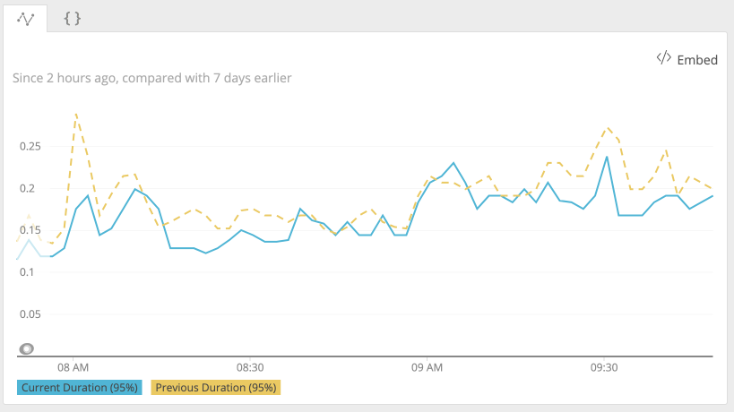

A while ago the Backend team at Close started to introduce Kafka for features built on top of [Event Log](https://developer.close.com/#event-log). We know it's a good fit for us and will provide ample opportunity to use the event stream with confidence.

## Data migration process

Things appeared to work alright for a while, but recently we needed to perform a data migration that required emitting a large amount of events. The migration process was written in the most simple way, since this type of code is run once, and thrown away when complete. One of the decisions made for simplicity was to run it as a single thread in a single process at first. This way we can easily work out bottlenecks by profiling how it runs. While profiling an initial test run, I noticed a non-trivial portion of the run time was taken by a `flush()` call of the Kafka producer. I mentioned this to my peers but we concluded that this is expected - and necessary since every event has to be delivered before we move on, to maintain maximum consistency.


## Threading

In most migrations we had before, scaling out was not necessary, we could just run it in background for a while with minimal impact. Not this time though. The volume of data that needed processing was so large that running it in one thread would take multiple months, so we needed to scale out. Performance metrics I've collected during initial runs indicated that impact will be minimal even if we run 10 migration processes. So in the next iteration the migration process was changed to run in multiple parallel threads in the same process. At Close, the main threading framework we use in Python is `gevent`. It's a green threading library that hooks into IO routines and schedules other green threads - greenlets - inside the same OS thread to run whenever currently running thread needs to wait on an IO operation to be complete.

However the parallelized migration wasn't doing as well as one would expect. Even on 7 parallel threads, the overall throughput improved by only 20-30%, very far from expected 7x increase. What's worse, increasing thread count further didn't improve anything - but there weren't any obvious bottlenecks. CPU usage was well below 100% on that thread, network IO had a lot of headroom, and databases didn't mind the load. The threads were completely independent and had nothing to share except the Python interpreter which wasn't that busy.


To move the project forward, I switched the migration to multi-process architecture, where separate Python OS processes (each with only single thread) worked on the data independently. This time we got the expected throughput increase proportionally to the number of processes.

## C extension

The multi-threaded performance issue was still on my mind though. I was thinking about kinds of inter-thread communication that could prevent ready threads from progressing while other threads were waiting on IO. I double-checked database IO but it was correctly handled by `gevent` - and we were using it this way for a long time, including in our `gevent`-based `gunicorn` web servers. And then the little detail about Kafka `flush()` call from earlier profiling results came to mind. I realized that, in contrast with other IO calls, the call stack just ended on the `flush` call from the kafka library, not on a builtin socket IO routine. Turns out, Kafka client is a C extension and it does IO from the C code, not Python. That means it blocks the entire OS thread until Kafka servers respond, and other greenlets cannot be scheduled during that wait. [It's a known issue with the official Kafka client](https://github.com/confluentinc/confluent-kafka-python/issues/612).

## Solutions

What do we do about it? We went through a couple options:

- Switch to a different, pure-Python library. This introduces additional unknowns and would require additional testing to make sure it matches our performance, functionality, and reliability requirements for a critical infrastructure component.
- Patch the C extension to let `gevent` loop to run. This is a cumbersome option that also introduces risk of bugs in a multi-threaded environment. We also didn’t know if the library could support multiple concurrent calls from the same thread.

The final path we chose depends on the fact that `flush` call is nothing more than a loop that calls `poll()` to handle responses from the server. So we implemented our own pure-Python `flush`. Instead of sleeping in C, we give control to `gevent` loop from Python code by simply calling `gevent.sleep()` after calling `poll(0)`.

```python
def flush(producer):
    while len(producer):
        producer.poll(0)
        gevent.sleep(0.001)
```

With the improved `gevent`-friendly `flush` implementation, I was able to saturate CPU with multiple threads in the migration process. This change also made a slight improvement for `gevent`-based web request processing. Now HTTP requests that are currently waiting on event delivery confirmation won’t delay other requests served by the same process.



## Closing thoughts

One should always be aware of blocking calls when working with asynchronous code. There are abstractions like `gevent` or `asyncio`, that let you treat async code as if it was synchronous, but keep in mind that these abstractions tend to leak sometimes. In case of Python specifically, note which of your dependencies are C extensions, as those can be blocking the main interpreter loop.
