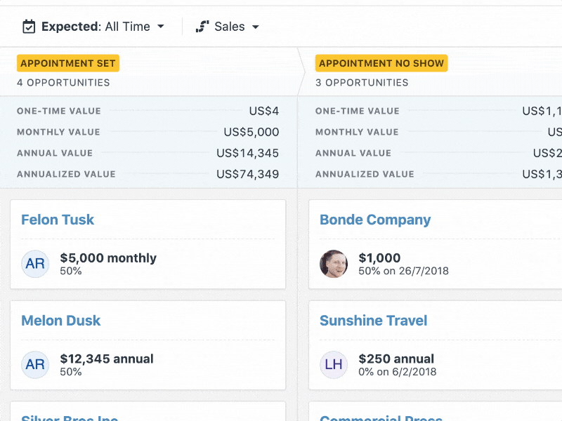
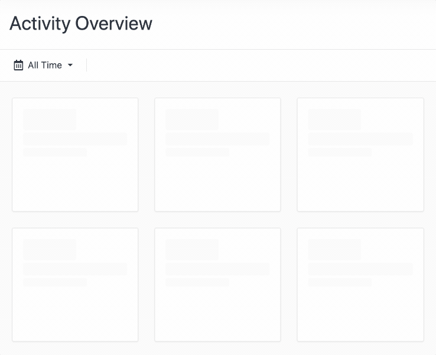
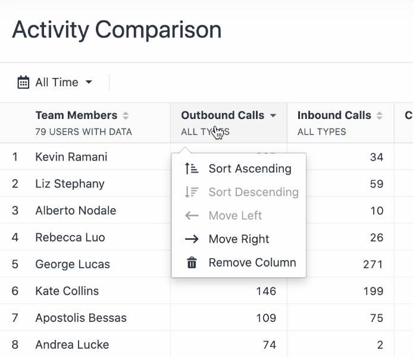

When building products at Close, there are some obvious things that we ship. A new side navigation. A new pipeline feature.
There are also some things that we ship that you might have missed. Minor details that we sneak in that we hope make the experience a little better, without anyone really seeing them.

When you change the optons in the Pipeline view, the totals shown at the top of each column transition from one number to another by spinning through every number in between.

If you want your avatar to show in Close, you can upload it to Gravatar and associate it with the email address you use in Close. Now, when you select your name, your avatar will appear in the button.

Want to move a column in the Cmparison Report? Every tried right clicking on the column header? Give it a try. There are some useful, contextual options that appear.

