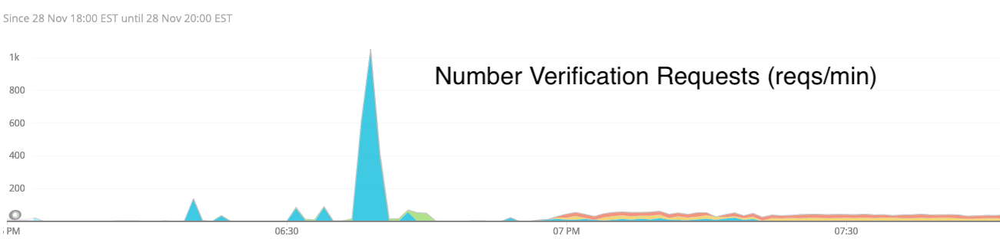
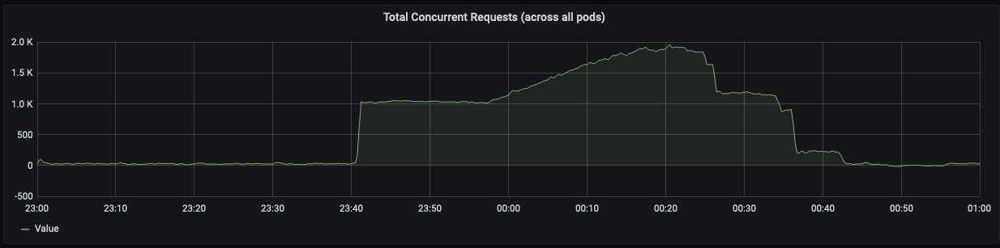
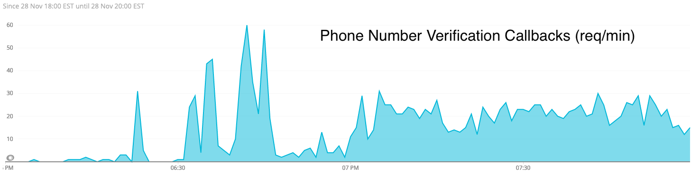
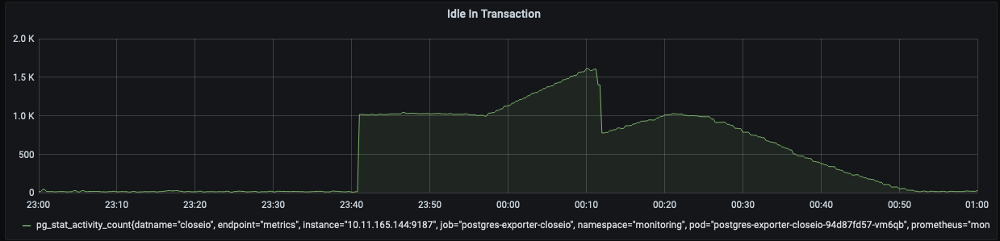
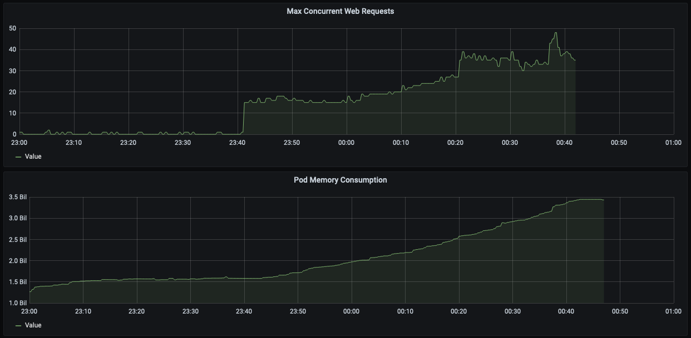
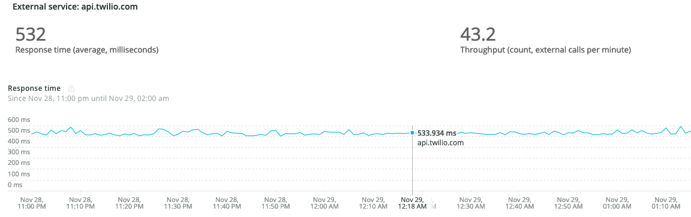
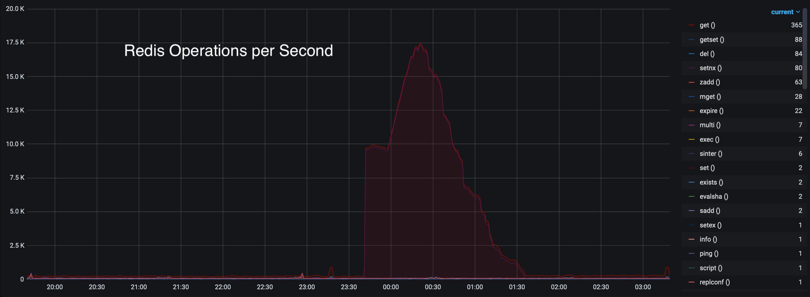
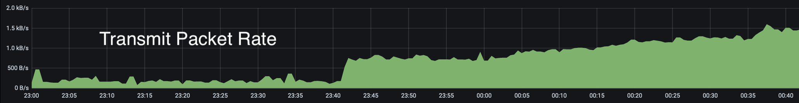
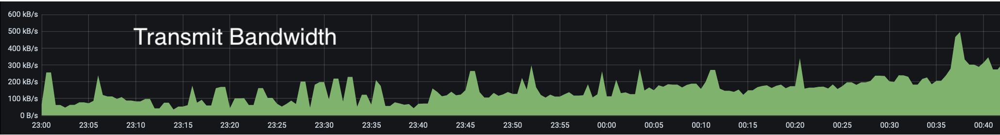

As a platform with a focus on calling, we’re often a target of fraudulent activities. More frequently than I’d have imagined before being in this business. Being a frequent target means more than just keeping tabs on our numbers, it means we get free stress testing from malicious actors! Yay! Here’s one of those times, *enjoy.*

## What did they do this time

Some fraudsters figured out that:

- We allow users to use their own numbers if they can prove ownership.
- They can reap benefit (or at least enjoyment) by using our ownership verification process to call arbitrary phone numbers.

They apparently realized they could do this *a lot.*




Note that the scale tops out at 1k requests/min, and even after the spike there were multiple organizations sending 20 requests/min. Keep in mind that each of these requests results in an *actual* phone call. In this context, 1000 requests per minute from a single user is *a lot*.

All these requests, it turns out, had consequences. *Surprise!* During their unannounced midnight stress test, for some reason requests backed up on our side. Somewhere in our call verification code path, we had a blocking operation. Our first guess was that piled up Twilio API calls caused unhandled networking issues. Of course, our first guess was wrong.




As requests started backing up, [Envoy](https://www.envoyproxy.io/) started timing out requests and responding with a 408. Unfortunately for us, Envoy closing the connection doesn’t kill our gunicorn greenlets which actually do the processing of verifying numbers.


What else do we know? Well, we *do* know that Twilio did get and act on a bunch of (but not all of) our requests, because we do have responses from them on the associated callback url:



## So what’s the problem here?

Well, stealing aside, this presented two infrastructure issues for us:

1. During the blocking call, there was an open transaction that became idle (and consumed a Postgres connection). This was a separate issue we addressed immediately.
2. Each concurrent request consumes incrementally more memory. Pods have a very high burst memory threshold, but if all pods use significantly more memory than is predicted, Kubernetes nodes start running out of memory (triggering OOM kills and other weird behavior).



## Ok well don’t do blocking calls, duh

It’s not that simple. See, we didn’t *intend* to have blocking calls here. Or at the very least, our blocking calls should all resolve concurrently and within a second or two at most. We do call some APIs (namely Twilio), but you see, Twilio does a pretty good job of responding to API requests. In fact, we actually have enough data to pretty confidently say it *wasn’t* on their end:




Blocking for a 500ms API call isn’t *great*, but it’s not keeping our requests pending for 40 minutes.

## Where is the time going then?

Well, looking through some of our other metrics, we stumbled upon this beauty:




Now that shape looks familiar… But why tho? We’ve got huge volumes of `get` and `setnx` operations that correlate *exactly* with our concurrent request totals.

Funnily enough, auditing our codebase we found exactly one place that hits both those operations: [`tasktiger.redis_lock.Lock`](https://github.com/closeio/tasktiger/blob/86377b89e2a8f88621e00f00fe208e64a69e34f1/tasktiger/redis_lock.py#L73-L79). For blocking locks (blocking is enabled by default), the acquisition code runs a busy loop of the above `setnx`/`get` that [runs every](https://github.com/closeio/tasktiger/blob/86377b89e2a8f88621e00f00fe208e64a69e34f1/tasktiger/redis_lock.py#L97) [`100ms`](https://github.com/closeio/tasktiger/blob/86377b89e2a8f88621e00f00fe208e64a69e34f1/tasktiger/redis_lock.py#L97) by default. That’s kind of weird though, because we actually use a different Redis instance for managing `tasktiger`, and this ain’t that one.

Another weird metric we’d yet to explain was elevated packet transmit and receive metrics (which didn’t increase total transmit bandwidth by the same factor):





## Locks, Locks, Locks

As further auditing revealed, we’ve been using `tasktiger`'s `Lock` implementation in some of our other code, independent of `tasktiger`… 👀 

There are two places that might `Lock` during a phone number verification request. The first is when checking that the account has enough funds to place a call. If we don’t have the account balance cached already, we lock while calling out to Stripe. Subsequent funds checks call Redis first, then return without locking if the balance is found.

The other place that calls `Lock` during phone number verification is done implicitly when creating a validation request. Our Twilio integration uses Organization-specific subaccounts, so whenever we do Organization-specific operations we first validate that the subaccount exists (creating one if it doesn’t) and use a `Lock` in the process. These locks are held for a max of `60s` until they automatically expire. Noteworthy (and counterintuitively), the `timeout` parameter of `Lock` *doesn’t actually time out the blocking call*. It just expires the lock in case a release was missed.

Now, neither of these locks seem particularly problematic. The first lock only happens once (then is cached in Redis), and the second lock is always acquired but only actually blocks for the duration of a Twilio API call the first time it's hit for a given organization (which based on what NewRelic has measured seems to be a pretty consistent 500ms average). So, after the first time an organization is hit, subsequent locks should exit immediately without doing any work.

What you, dear reader, (and we), didn’t know is that our `Lock` implementation has a race condition. The locking code in question came from an old version of `redis-py`, which implemented locking based on [this Redis design pattern](https://redis.io/commands/setnx#design-pattern-locking-with-codesetnxcode) and hadn’t yet been upgraded to use the [more recent locking implementation](https://medium.com/@rohansaraf/distributed-locking-with-redis-ecb0773e7695). The old version works something like this (simplified for demonstration purposes):

```python
def acquire(self):
  while True:
    timeout_at = now + 60s
    if redis.setnx(key, timeout_at):  # set if not exists
      self.acquired_until = timeout  # we got the lock!
      return
  
    existing_expires_at = redis.get(key) # check if lock is expired
    if existing < now: # the existing lock is expired! Let's grab it
      exiting = redis.getset(key, timeout_at) or 1 # set, return old value
      if existing < now:  # double check the old lock was expired
        self.acquired_until = timeout  # we got the lock!
        return
    sleep(.1s)

def release(self):
  existing = redis.get(key)  # get the lock expiration time
  if existing >= self.acquired_until:  # if the lock expires after our lease
    redis.delete(key)  # delete the lock
  # if the lock expired before our lease, another process could have grabbed
  # it in the mean time
```

Not a super obvious race condition, huh? Consider that we have a lot of greenlets trying to grab the same lock, some of them on this same process. Every time we hit a `sleep` or Redis command, `gevent` yields control to another greenlet. Beyond greenlets yielding to each other, we also have `N` threads working different greenlets at the same time. With that in mind, let’s step through the problematic scenario:

```python
# someone else already has a lock
# there's a lot of other greenlets also fighting for the lock

def acquire(self):
  while True:
    timeout_at = now + 60s
    if redis.setnx(key, timeout_at):  # it's not set, don't enter the block
      self.acquired_until = timeout
      return
    
    # the other process which got the lock finishes, and frees the lock
  
    existing_expires_at = redis.get(key) # grab the expired value (now None)

    # a third process runs the `setnx` command above and grabs the
    # lock (setting the key to some timeout value)

    if existing < now: # the existing lock is expired! Let's grab it

      # we set our timeout value, and get back the timeout value from the
      # other process's newly set lock
      exiting = redis.getset(key, timeout_at) or 1
      
      # we got back a real value instead of 1, we didn't get the lock
      # (don't return)
      if existing < now:
        return

    # Ok, let's sleep and try again
    sleep(.1s)
```

Seems pretty benign, right? *Wrong*.

So our process didn’t actually grab the lock. It thought it was going to, but another greenlet got it first. But while our greenlet didn’t get the lock, you’ll notice that it *did* write to Redis with `getset`.

Still seems pretty benign, right? *Wrong again*.

You see, when there’s lots of greenlets fighting for control of one thread, each of these loops (and Redis calls) can take a while to run. And they yield control every time a Redis command is executed. Let’s say we’ve got so many of these that just *one* inner loop takes more than 100ms for a greenlet to run. When it hits `getset`, it’s going to use the value from all the way up there at the top of this loop. Over 100ms ago. Probably an older value than what the other process just set.

But this still isn’t a problem? Two locks didn’t get acquired did they? *Just you wait.*

Take off your greenlet-waiting-for-lock hat, and put on your third-process-that-got-the-lock hat. We’ve gotten the lock (from the `setnx` command in the above block), we’ve done our processing, and we’re ready to release it. Let’s look at the release code:

```python
def release(self):
  existing = redis.get(key)  # get the lock expiration time
  # `existing` is the value the other greenlet set above, about 100ms before
  # our lock acquisition would expire.

  # our `self.acquired_until` is _later_ than the value we grabbed from Redis
  # don't enter the block below
  if existing >= self.acquired_until:
    redis.delete(key)  # we didn't enter this block, don't delete the key

  # we didn't free the lock in redis
```

Uh oh… So we didn’t actually free the lock? *Nope.*

So the scenario where we have a lot of greenlets/processes/whatever vying for the same lock is also the one where we might accidentally not free locks. If we’re locking around a call to an external API, p50 is probably 500ms but our timeout is maybe 30s or 60s. When load spikes, instead of taking .5s on average, we’re going closer to 60s. In our case, that meant concurrent requests piled up, ate all the memory of our nodes, and eventually triggered OOM kills forcing us to drain and replace whole Kubernetes nodes. Also noteworthy is that by default, locks *don’t have a timeout* and failing to free one will block other locks indefinitely (even restarting processes won’t help because they’re persisted in Redis).

The resolution here is simple: use the (newer) [redis-py](https://github.com/andymccurdy/redis-py/blob/2.10.6/redis/lock.py) [built-in locking implementation](https://github.com/andymccurdy/redis-py/blob/2.10.6/redis/lock.py). The more intuitive way to do locks (using Redis key expiration for timeouts) is the recommended way these days. The python API is exactly the same too, nice bonus! They’re not compatible with each other so transitioning is a bit of a pain, but undoubtedly worthwhile. Another fun followup is reading Martin Kleppmann’s [How to do distributed locking](https://martin.kleppmann.com/2016/02/08/how-to-do-distributed-locking.html) post, which goes into further detail on how to not mess up locking.

Of course we also put some additional safety checks into the number verification process to prevent this fraudulent activity, but that’s unrelated to the locking bug.

## So what are the takeaways here?

1. Concurrency and distributed systems are hard.
3. Race conditions are problematic.
2. Metric retention and postmortems are *worth* the investment.

Hold up, let me reiterate: *metric collection and retention enable us to complete postmortems, and good postmortems improve processes.* Race conditions in battle-tested locking code were *not* our first idea as to what caused the failures here. In investigating this incident, we used Prometheus + Grafana with both standard and custom metrics, Kibana to investigate both application and Envoy logs, and NewRelic’s tracing + insights. These tools aren’t trivial to set up correctly, but man are they good to have when you need them.

We got lucky that we were hit during a low traffic period, and the fraudsters’ shenanigans didn’t have any customer impact. By having all this data around, we were able to discover the root cause after the fact and moving forward can prevent this failure condition everywhere we use locks.
