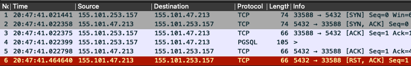
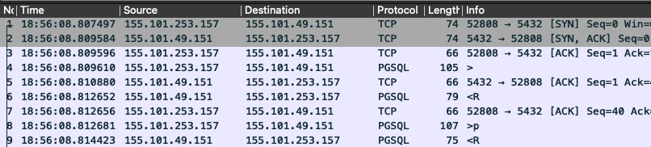

We recently had some connection issues to our AWS RDS PostgreSQL databases. They started out somewhat sporadic but were gaining in frequency to the point where something had to be done to fix them. We had recently introduced [RDS Proxies](https://aws.amazon.com/rds/proxy/) and believed they were the likely cause of the issue. The errors often occurred during connection setup, so getting a packet capture during a failure seem like it would likely give some insight into which side was misbehaving.

In the past, running [tcpdump](https://www.tcpdump.org/index.html) on a few nodes to grab the capture would have been a relatively easy task. AWS Support actually ended up asking us to do a packet capture to get more info. Seemed strange to me that they were asking us to do packet captures to troubleshoot their proxies but I guess *Welcome to the Cloud.* Unfortunately, the days of having a few nodes that are likely chokepoints to grab a capture like this are long gone.

Our modern infrastructure made it seem like this was going to be a very tedious task. There were a number of factors that were going to make this challenging:

- The packet captures would likely have to run for multiple hours to have a chance of catching one of the failures.
- The server side is a RDS Proxy managed by AWS so although this is the obvious chokepoint to do the capture we don’t have access to that instance.
- Our app code runs on Kubernetes so we would have to either run tcpdump in the pod or on the underlying host instance.
- We use Amazon Elastic Kubernetes Service (EKS) so each pod has a separate network interface on the host instance. This would make it difficult to know which interface to capture. Note: while writing this post I noticed that tcpdump will accept `-i any` which would theoretically capture packets on all interface. Would have to see how this would work out on an EKS node with numerous interfaces.
- Our EKS instances are autoscaled so that even if we ran tcpdump on the Kubernetes nodes there would be a chance the EC2 instance would get terminated due to other changes in our infrastructure.
- We have many pods running that are all automatically deployed via our CI/CD pipeline. Connecting to each one manually to start a capture wasn’t really a viable option.

None of these factors were unsurmountable but I really just wanted to run a quick tcpdump somewhere and see what was going on. It turned out that with just a few adjustments I could do a tcpdump like I always have.


## 1. Limit capture size

The first concern was that if we run many instances of tcpdump they could overwhelm the container or host’s filesystem. There are two useful command line options to control how tcpdump stores capture files. The first is the `-C` option that tells tcpdump to write to a new capture file once the current file reaches a certain size. The second option is `-W` which tells tcpdump the number of old capture files to keep around. We decided to use `-C 100 -W 10`, telling tcpdump to keep a maximum of ten 100MB files.  Now no matter how long a single instance of tcpdump was run, it would only take up to 1 GB of disk space.


## 2. Run tcpdump in a pod

Capturing packets inside a pod seemed like the best spot to run tcpdump. We already did this manually when troubleshooting tricky issues by getting into a pod with `docker exec -t -i -u root [container id]` . But we use a non-root user to run the app code in our containers so this user wouldn’t have permissions to run `tcpdump`. The following line was added to the container’s `/etc/sudoers` file to allow the app user to start tcpdump via sudo.

```
    appuser ALL=(ALL:ALL) NOPASSWD: /usr/sbin/tcpdump
```

The entrypoint into our app images is a bash script, so I added the following line to kick off tcpdump in the background before the container started the normal app code.

```
    sudo tcpdump -w /scratch/proxy.pcap -C 100 -W 10 host pluto.proxy-xyz.us-west-2.rds.amazonaws.com &
```

I did confirm that if you specify a hostname to tcpdump it will capture packets for all IP addresses that hostname resolves to. This was important because the RDS proxy hostname was going to resolve to at least two different IP addresses and we would want to capture traffic to all of them.


## 3. Capture file storage

I didn’t want to keep capture files in the pod’s container filesystem. Luckily Kubernetes has an easy way of mounting temporary space on the host instance’s filesystem. We use [Kustomize](https://kustomize.io/) to manage our Kubernetes manifests. I just needed to add the following two snippets to one of our yaml files to get an [emptyDir](https://kubernetes.io/docs/concepts/storage/volumes/#emptydir) volume added to each of our pods. The emptyDir is automatically deleted when the pod terminates so I didn’t need to worry about old files accumulating on the host instance.

```
          volumes:
            - name: scratch
              emptyDir: {}
```

The volume is mounted in the pod with this configuration:

```
            volumeMounts:
              - name: scratch
                mountPath: /scratch
```

## Outcome

I decided to deploy this configuration to just our canary pods to see how well it works. I wasn’t 100% sure how much load this would add to the host instance so I chose having to wait longer to capture a failure on just a subset of our pods versus figuring out it if was safe to deploy to all of our pods. It took about 8 hours but eventually we got a Rollbar indicating one of the pods running the capture had just experienced the issue.

I grabbed the capture file from the pod and loaded it into Wireshark. It quickly showed the RDS Proxy, 155.101.47.213 in this capture, was abruptly shutting down the TCP socket during the connection sequence. You can see our app code sends the PostgreSQL [*Startup Message*](https://www.postgresql.org/docs/10/protocol-flow.html#id-1.10.5.7.3) in packet 4 and then the RDS Proxy first ACKs that packet and shortly thereafter sends a `RST`  packet to shutdown the socket. This was the evidence needed to confirm the RDS Proxy was stopping the connection from being established. Our app code seemed to be working as expected in this capture.





We provided the capture to AWS Support and pointed out some suspect messages in the RDS Proxy debug logs. After waiting for a bit we were notified a fix had been rolled out to proxies in all AWS regions. The majority of failures went away but we still have a few to investigate.

For completeness, here is a capture of a successful connection sequence. The client sends the *Startup Message in* packet 4 and the server responds with an *Authentication Request* in packet 6. The client responds in packet 8 with credentials and the connection is ready to go.




PS: I was able to use [tcprewrite](https://tcpreplay.appneta.com/wiki/tcprewrite-man.html) to randomize the IP addresses in the production captures I used to create the screenshots in this post. It was a handy tool I could have used in the past to provide capture files to support engineers.
