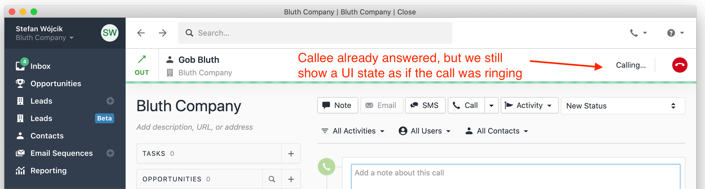
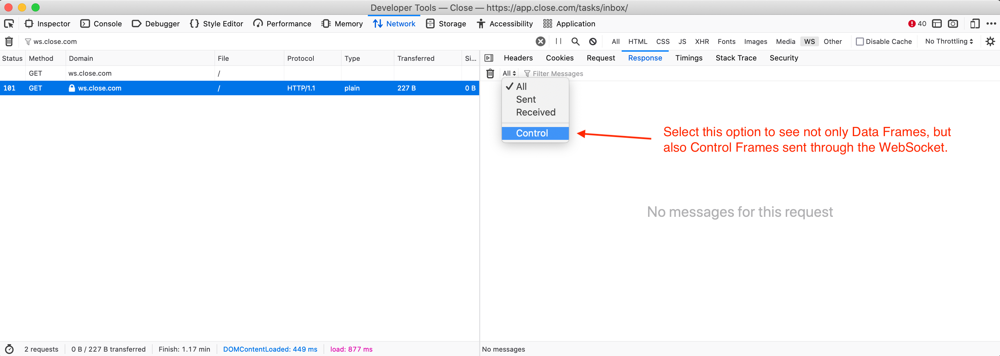

We have recently squashed two long-standing calling bugs in Close with a single
fix: Making our WebSocket connections bidirectionally robust. The final
solution turned out to be quite simple, but getting there required
understanding browser limitations, playing with our networking hardware,
refreshing our knowledge of the Internet's foundational RFCs, and digging into
several layers of logging. Let's start at the beginning though...

# The Problem

[Our customers love Close](https://www.g2.com/products/close/reviews) for many
reasons, but one of the top ones is our built-in calling. However, over the
last few months we'd sporadically receive concerning bug reports about this
feature:
* Sometimes, when a Close user called a contact, the far end would pick up, but
  our UI still looked as if the call was ringing.
* Other times, a contact would call a Close user, but the ringtone would keep
  playing even after the user answered the call.



We couldn't reproduce either of these bugs and thus we had two options to
choose from:
1. The (sadly all too) common approach to rarely occurring bugs & edge cases:
   Pretend like the problem doesn't exist. Blame it on faulty networking, solar
   flares, etc.
2. The responsible approach: Iteratively work your way through the problem,
   identifying what you don't know yet, and coming up with ways to answer your
   questions through logging, monitoring, additional tests, code refactors,
   research, etc.

We chose the latter.

# Pulling The Thread

After a few rounds of logging improvements, we could walk through each step of
the "call answered" event's journey and see where it veers off course. We saw
that:
1. When the callee answers the problematic call, Twilio ([our telephony
   provider](https://twilio.com)) recognizes this fact and sends a webhook
   about it to our backend servers.
2. Our backend receives the Twilio webhook and processes it successfully. This
   includes publishing a "this call is now in progress" event to SocketShark
   ([our open-source tool for managing WebSocket connections, based on Redis
   and Python/asyncio](https://github.com/closeio/socketshark)).
3. SocketShark receives the Redis event and *attempts to* deliver it via a
   WebSocket to the relevant user. **However, in case of the problematic calls,
   this turned out to be a no-op because the target user didn't have an active
   WebSocket connection.**

This came as a surprise. Our system is set up in a way where you should
*always* have an active WebSocket connection. We ensure this is the case in two
ways:
1. As recommended by [RFC 6455](https://datatracker.ietf.org/doc/html/rfc6455)
   (which defines the WebSocket protocol), our backend sends periodic [`Ping`
   Control Frames](https://datatracker.ietf.org/doc/html/rfc6455#section-5.5.2)
   to each connected client. If it doesn't receive a matching [`Pong`
   frame](https://datatracker.ietf.org/doc/html/rfc6455#section-5.5.3)
   ("matching" means that it contains the same random 4 bytes of "application
   data") within a reasonable time, it closes the connection.
2. Our UI uses the [`reconnecting-websocket`
   library](https://github.com/pladaria/reconnecting-websocket) and attempts to
   establish a new connection quite aggressively as soon as it determines that
   the previous connection was closed.

What were we missing then?

# A Healthy Dose Of Self-Doubt

When it comes to debugging unexpected behavior, it's often good to start with
challenging your own assumptions. It's not enough to read a comment or glance
at a piece of code. **You need prove that what you *think* your code does is
truly what happens.**

That was our next step. We fired up the Close app, waited for our WebSocket
to connect, and verified if the `Ping` and `Pong` control frames are sent back
and forth. There's an important gotcha here though: In many browsers (e.g.
Chromium-based browsers like MS Edge, Electron, and, well, Chrome), you can't
see the Control Frames in the Network Monitor *at all*. Fortunately, Firefox
has a way to make them visible:




Alright, we've confirmed our first assumption – pings and pongs are flowing
nicely. Time to move on to the second assumption – is the
`reconnecting-websocket` working as advertised?

# Breaking A WebSocket Connection

Our first attempt at permanently breaking the WebSocket connection was quite
naive. We simply turned the Wi-Fi off and on again. That worked fine: The UI
immediately recognized that the WebSocket connection got severed and
reestablished it as soon as we got back online.

The second attempt involved playing with the Network Monitor built into the
browser and its throttling options. Sadly, it turns out that both
[Firefox](https://bugzilla.mozilla.org/show_bug.cgi?id=1421357) and
[Chrome](https://bugs.chromium.org/p/chromium/issues/detail?id=423246) only
support throttling for *HTTP connections* and not for *WebSockets*. Moving on…

The third attempt was a bit more complicated:
1. We looked up the current IPs of our Load Balancer using `nslookup`.
2. Then, we used `/etc/hosts` to pin one of those IPs to `app.close.com` (the
   domain for our application's HTTP requests) and another IP to `ws.close.com`
   (the domain for our WebSocket connections).
3. We loaded the Close app and waited for the WebSocket to connect.
4. Then, we re-routed outbound TCP packets destined for the WebSocket-pinned IP
   to a bogus local IP, so that they'd never reach our production servers:
   ```
   sudo route -n add -net PINNED_WEBSOCKET_IP_ADDRESS BOGUS_LOCAL_ADDRESS
   ```
5. We waited for SocketShark's pings to time out and close the connection,
   since they no longer received pongs from our client.
6. We removed the bogus entry from the routing table and observed what would
   happen in the UI.

(Un)fortunately, this also worked fine. As soon as the server closed the
connection, the UI would try to reconnect repeatedly and – once we removed the
bogus routing table entry – it would succeed. This, again, didn't explain how
our users could have no active WebSocket connection for minutes or even hours.

This last attempt failed at reproducing the problem, but it informed our next
steps. **This is another important lesson in debugging tricky problems – you
sometimes have to try unlikely scenarios, first to rule them out, and second to
inspire your next steps.**

As described in [RFC 6455](https://datatracker.ietf.org/doc/html/rfc6455),
WebSockets use [TCP](https://datatracker.ietf.org/doc/html/rfc793) for the
underlying connection. The fact that the UI immediately recognized that the
server closed its side of the WebSocket connection showed us that the TCP
packet containing the FIN flag (responsible for communicating the [closure of
the connection](https://www.geeksforgeeks.org/tcp-connection-termination/)) was
successfully received by the client. Could we break the connection in a way
where the server-sent TCP FIN packet never made it to the client?

Replicating this scenario turned out to be quite simple, once we set our mind
on it:
1. We opened the Close app and waited for the WebSocket to connect.
2. We unplugged the Ethernet cable from the router and waited for SocketShark's
   pings to time out and close the connection. **This time, the TCP FIN packet
   would not make it to the UI client**.
3. We plugged the Ethernet cable back in and waited for the Internet connection
   to come back… **And there it was! The UI never recognized that its WebSocket
   connection was broken and never attempted to reconnect.**

# The Fix

The elation from finding reliable reproduction steps didn't last long. We still
needed to figure out how to implement a correct fix. First, we did a recap of
everything we knew:
1. Our WebSocket reconnects as soon as it recognizes that its previous
   connection is closed.
2. There is a networking failure scenario in which the UI side of our WebSocket
   doesn't recognize that its connection is closed.
3. [RFC 6455](https://datatracker.ietf.org/doc/html/rfc6455) defines the
   WebSocket protocol, which supports two different types of frames: [Control
   Frames](https://datatracker.ietf.org/doc/html/rfc6455#section-5.5) (`Ping`,
   `Pong`, and `Close`) and [Data
   Frames](https://datatracker.ietf.org/doc/html/rfc6455#section-5.6) (frames
   that carry your actual data). It also suggests that [`Ping` control
   frames](https://datatracker.ietf.org/doc/html/rfc6455#section-5.5.2) "may
   serve either as a keepalive or **as a means to verify that the remote
   endpoint is still responsive.**" (emphasis ours).
4. The backend side of the connection already sends `Ping`s and receives
   client-sent `Pongs` to determine whether it's still connected to the UI.

This is when it hit us: **Our UI needs the equivalent ping/pong mechanism as
the backend to ensure connectivity on its side of the connection.**

Unfortunately, browsers do not expose an API for sending `Ping` control frames
to the server nor acting on received `Pong` frames. [The request to expose such
APIs has been rejected by the W3C years
ago](https://www.w3.org/Bugs/Public/show_bug.cgi?id=13104). We were thus
forced to implement this mechanism ourselves, using regular data frames. This
is [exactly what we did](https://github.com/closeio/socketshark/pull/73) and it
worked like a charm! We haven't received a single report of the aforementioned
bugs since we've shipped it.

# Conclusions

There are a few lessons that we're going to take away from this bugfix:
1. Always make sure that you periodically poke **both sides** of any long-lived
   TCP connection.
2. Not every connection failure is easy to simulate with software. Sometimes it
   makes sense to play with the good old hardware, power things down, unplug
   some cables, etc.
3. When in doubt, add more logging. Pull a thread till you find where it snaps.
4. Go through many possible failure scenarios, even the unlikely ones, first to
   rule them out and second to inspire your next steps.
