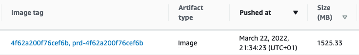
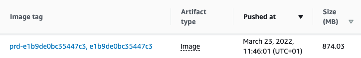

At Close, we build Docker images with our Frontend code for multiple purposes like:

- for Frontend software engineers to develop the Frontend app
- for Backend software engineers to run the app
- to be used in staging
- to be used in production

## Leveraging Docker Layer Caching

Since multiple images that are built during the CI/CD process are based on the same image, we are using Docker Layer Caching to speed up the build process. Instead of re-building the same part of the image multiple times, we read from the cache.

Our Dockerfile is similar to this:

```docker
# Dockerfile

FROM node:14.19.0 AS stage_0

# Deps needed for our development image
RUN apt-get update && \
  apt-get install -y --no-install-recommends \
	libgtk2.0-0 libgtk-3-0 libgbm-dev
# ... and some other stuff

COPY package.json yarn.lock ./

RUN yarn install --frozen-lockfile

CMD ["yarn", "run", "watch"]

FROM stage_0 AS stage_dev

COPY . .

FROM stage_dev AS stage_build

ARG NODE_ENV
ARG BUILD_VERSION

RUN yarn run build:app

FROM nginx:1.19.2 AS stage_static

COPY --from=stage_build /opt/app/ui/dist/ /var/www/dist

# ...some other NGINX related commands
```

As you can see above, we start with the `stage_0` image definition. It is done for caching purposes. This way we don’t need to re-install packages whenever any part of the code changes. `stage_0` will be rebuilt only if dependencies are changed (`package.json` or `yarn.lock`).

Then, there is the `stage_dev`, where we copy all files needed for the Frontend image to run. This image is later used in the CI/CD checks like linting or unit testing. It is also used by Frontend developers to run the Frontend app in the Docker environment.

Finally, we have the `stage_build` stage where the static app is built. The built app is then copied to a lightweight NGINX image. When Backend developers don’t need to edit Frontend code, they can run just the Backend part of the stack together with this pre-built Frontend image. It has the advantage of spinning up very quickly.

## Large Docker images issue

When initially the Frontend dev image was built, we ended up with a huge 1.5GB image. This became too large for a couple of reasons:

- it slowed down the CI/CD jobs because multiple jobs had to download the image
- it was able to exhaust CI/CD memory resources causing jobs to fail randomly
- final images were taking more AWS ECR space than they needed to



With the above Dockerfile configuration, our dev image was 1.5GB.

## Yarn’s Cache & Docker Layer Caching

After analyzing the output image and the Dockerfile commands, the immediate question I’ve asked myself is whether `yarn` creates its cache files when installing packages. Yes, it does and there is no way to disable it at the installation stage. Though, it can be removed after the `install` command is done. 

### Removing Yarn’s cache from the image

I’ve edited the Dockerfile to clean Yarn’s cache as follows:

```docker
RUN yarn install --frozen-lockfile
RUN yarn cache clean
```

It didn’t make much difference though. We ended up with the same final image size due to the fact how Docker Layer Caching Works.

When building an image from Dockerfile, Docker will create a "cache layer" for each line of the Dockerfile. In our case this means that the `RUN yarn install --frozen-lockfile` created a large cache layer (with both node modules installed and yarn’s cache saved to the disk). The next command `RUN yarn cache clean` removed the access to the yarn’s cache from the final image but it had no way to remove it from the Docker Layer Cache for the previous line. This resulted in the unchanged image size.

If you are curious about the details of Docker Layer Caching for your images, I encourage you to try out [a great open-source tool `dive`](https://github.com/wagoodman/dive) that will output useful information for each line of your Dockerfile.

### Installing packages without Yarn’s cache

As mentioned before, there is no way to install node modules with yarn not creating its cache. To solve this we can leverage the fact that Docker Layer Cache is created after a line in the Dockerfile is done running. This means we need to edit the Dockerfile to look like this:

```docker
RUN yarn install --frozen-lockfile && \
	yarn cache clean
```

Because now we install modules and clean cache in a single line, the Docker Layer Cache for this line won’t include yarn’s cache.

With this change, we were able to reduce the size of the final dev image by almost 50%.



## The takeaway

- Be aware that it’s likely that your package manager of choice likely creates cache files. Find a way to remove it from the image.
- Run the “cache clean” command in the same `RUN` command, so when Docker Layer Cache is saved, it doesn’t include cached files.

If you want to join our Engineering team, check out our open positions at [https://making.close.com/jobs/](https://making.close.com/jobs/)

Do you have any questions? Are you curious about how working at Close is? Feel free to hit me up on Twitter [@bartgryszko](https://twitter.com/bartgryszko).
