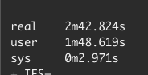
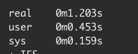

A part of Close's frontend CI/CD process is static files upload. It happens after one of the jobs finishes building the app with Webpack. The result is static HTML and a bunch of assets like JavaScript files, CSS files, source maps, images, fonts, and sounds. Even though individual files are rather small, they add up to almost 100MB in total (gzipped).

We uploaded the generated assets to the S3 bucket with a single bash command:

```bash
aws --region=us-west-2 s3 sync \
  --acl="public-read" \
  --cache-control="public, max-age=31536000" \
  dist s3://$S3_STATIC_ASSETS_BUCKET/dist/
```

## Multiplying `sync` command

At some point, we’ve noticed that `aws cli` didn’t upload some of our files correctly to the S3. Because `Content-Type`  header didn’t have `charset=utf-8` we’ve sometimes seen display issues in our app.

There is an open issue about [the inability to set charset when mime-types are guessed](https://github.com/aws/aws-cli/issues/1346) in the official AWS CLI repo.

Since there was no native support for setting the right charset, we wrote a script to set it for us. It ran in the CI/CD process and looked more or less like that:

```bash
UTF8_FILE_TYPES="\
js | application/javascript
css | text/css
html | text/html
txt | text/plain
xml | application/xml
"

OTHER_FILE_TYPES="\
png | image/png
woff2 | font/woff2
woff | font/woff
mp3 | audio/mpeg
ico | image/x-icon
gif | image/gif
"

sync_to_s3() {
  INPUT=$1
  APPEND_CONTENT_TYPE=$2

  while IFS= read -r line; do
    FILE_TYPE="${line% | *}"
    MIME_TYPE="${line#* | }"

    aws --region=us-west-2 s3 sync \
      --acl "public-read" \
      --cache-control "public, max-age=31536000" \
      --content-type "$MIME_TYPE$APPEND_CONTENT_TYPE" \
      --exclude "*" \
      --include "*.$FILE_TYPE" \
      dist s3://$S3_STATIC_ASSETS_BUCKET/dist/
  done <<< "$INPUT"
}

sync_to_s3 "$UTF8_FILE_TYPES" "; charset=utf-8"
sync_to_s3 "$OTHER_FILE_TYPES" ""
```

We opted-out of AWS mime-type guessing and set it manually for each file type. We were also now running the `sync` command 11 times instead of just 1.

## 38 minutes upload time

To my surprise, the assets upload time increased from around 4 minutes to 38 minutes.


That was definitely too big of an increase. It took more time to upload the final assets than to run all other checks in the CI/CD. I’ve started an investigation.

The quick thing to do was to check which sync command is taking so long. I’ve prepended the command with `time` and looked for the results.

```diff
- aws --region=us-west-2 s3 sync \
+ time aws --region=us-west-2 s3 sync \
```

As it turned out, it didn’t really matter how many files we were about to upload. All of our `sync` commands took around 2:40 minutes to complete.



After digging more, it came out is that the `sync` command takes some much time because of how big our S3 bucket is. We keep thousands of files there. The `sync` needs to list all of the existing files in the bucket to compare them against the currently uploaded. With each next deployment, it took more time to run the job for uploading static assets.

## `cp` to the rescue

We used the `sync` command historically, but didn’t really need to. Most of our generated files are changed with each deployment anyway. We could just upload them to the S3 bucket without doing any comparison on the AWS side. 

We’ve substituted `sync` with `cp` and confronted results. Our `sync_to_s3` function looks like this now:

```bash
sync_to_s3() {
  INPUT=$1
  APPEND_CONTENT_TYPE=$2

  while IFS= read -r line; do
    FILE_TYPE="${line% | *}"
    MIME_TYPE="${line#* | }"

    aws --region=us-west-2 s3 cp \
      --acl "public-read" \
      --cache-control "public, max-age=31536000" \
      --content-type "$MIME_TYPE$APPEND_CONTENT_TYPE" \
      --exclude "*" \
      --include "*.$FILE_TYPE" \
      dist s3://$S3_STATIC_ASSETS_BUCKET/dist/ \
			--recursive
  done <<< "$INPUT"
}
```

Each `cp` command now takes around 1 second to finish (instead of ~2:40 minutes).



The total time for the `assets-upload` job is now around 1:30 minutes. With the final change, we’ve fixed the issue of 38 minutes static upload. We were also able to beat the historical assets upload job by around 2:30 minutes.


## Key take aways

- The AWS CLI `sync` command needs to list all of the existing files in the S3 bucket to compare them against the currently uploaded files.
- The bigger S3 bucket is, the slower the `sync` will be.
- Make sure you really take advantage of `sync` and if not, consider using `cp`.
- In our case, a single `sync` command took ~2:30 minutes to complete, while copying the same files via `cp` took around 1 second.

If you want to join our Engineering team, check out our open positions at [https://making.close.com/jobs/](https://making.close.com/jobs/)

Do you have any questions? Are you curious about how working at Close is? Feel free to hit me up on Twitter [@bartgryszko](https://twitter.com/bartgryszko).