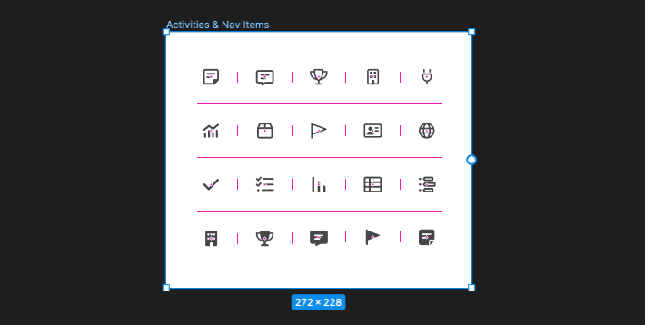

Have you ever found yourself repeatedly exporting icons from Figma, running them through an optimization tool like [svgo](https://github.com/svg/svgo), and then manually copying them to your codebase?

If so, you're not alone. As a designer or developer, this task can become a tedious and time-consuming part of your workflow, particularly when you're working with a large number of icons.

At Close, we offer a [comprehensive sales automation platform](https://www.close.com/product) that enables teams to manage their sales processes more efficiently.

With features ranging from lead management to email automation and reporting, our web application is quite complex. That complexity makes it essential to have clear and consistent icons. Without them, our users could easily become confused and frustrated. They might even click the wrong button, triggering unintended consequences.

For the reasons above, we rely heavily on icons throughout the codebase and keeping more than 300 icons aligned with design iterations is something that we wanted to automate.


## Enter our `figmaToSvg` solution

Considering all the points above, we had two main outcomes in mind for this automation:

-   **Enforcing naming consistency between Figma and our codebase:** This would guarantee that when our designers changed an icon on Figma, a developer could easily retrace all the points in the codebase where that icon was used. It would also ensure we don't have duplicate entries.
-   **Unifying the approach we take to SVG Optimization:** SVGs files can be large, especially if they are complex or contain unnecessary metadata or code. This can impact web app performance, leading to slower load times, increased bandwidth usage, and decreased user satisfaction. By optimizing SVGs, we can remove any unnecessary code, compress the file size, and improve web app performance, making for a better user experience.

This typescript implementation is largely split into 4 macro areas:

-   [Step 1:](#1-fetching-all-children-nodes-from-a-parent-node) Fetching all children nodes from a parent node
-   [Step 2:](#2-filtering-out-only-components) Filtering out only `COMPONENT` which we will assume are all SVGs
-   [Step 3:](#3-downloading-and-optimizing-each-svg) Downloading and optimizing each SVG
-   [Step 4:](#4-saving-the-optimized-svgs-to-our-output-folder) Saving the optimized SVGs to the output folder

## 1. Fetching all children nodes from a parent node

A parent node in Figma is called a `frame` or a `container`. Here's what it looks like:



In this case, _“_Activities & Nav items_”_ is our frame, we can get its ID by selecting it and extracting it from the URL: `https://www.figma.com/file/{figmaProjectId}?node-id=39-21`
As you can see, `39-21` is the `nodeId`.

We can then call the function below `fetchFigmaNodeChildren` to get all children nodes, regardless of if they are components or not.

```ts

async function fetchFigmaNodeChildren(  
  figmaProjectId: string,  
  figmaAuthToken: string,  
  nodeId: string,  
) {  
  const url = new URL(`https://api.figma.com/v1/files/${figmaProjectId}/nodes`);  
  url.searchParams.set('ids', nodeId);
  const svgJSONResponse = await fetch(url, {  
    headers: {  
      'X-Figma-Token': figmaAuthToken,  
    },  
  });  

  // {node} will contain the json representation {nodeId}
  const node = await svgJSONResponse.json();

  // We can then get all the children of our scanned node  
  return node.nodes[nodeId].document.children;  
}
```
## 2. Filtering out only `COMPONENT`s

Since the above `fetchFigmaNodeChildren` returns all children nodes, even ones that are not components, we need to recursively filter and flatten its children.
```ts
type FigmaNode = {  
  id: string;  
  name: string;  
};  
  
function findAllNodesByValue(  
  rootNode: FigmaNode,  
  valueToFind: string,  
): FigmaNode[] {  
  return Object.values(rootNode).reduce((acc, value) => {  
    if (value === valueToFind) { 
      return acc.concat({  
        id: Object.values(rootNode.id).join(''),  
        name: Object.values(rootNode.name).join(''),  
      });  
    }  
  
    if (typeof value === 'object' && value !== null) {
      // This child has more children, recurse
      return acc.concat(findAllNodesByValue(value, valueToFind));  
    }  
  
    return acc;  
  }, [] as FigmaNode[]);  
}
```

We can call the function above by passing the result of [Step 1](#1-fetching-all-children-nodes-from-a-parent-node).

```ts
const children = await fetchFigmaNodeChildren(  
  figmaProjectId,  
  figmaAuthToken,  
  figmaFrameId,  
);  

const svgNodes = findAllNodesByValue(children, 'COMPONENT');
```

Now that we have all svgNodes we can fetch each one from Figma using the following `fetchFigmaSvg` function.

```ts
async function fetchFigmaSvg(  
  figmaProjectId: string,  
  figmaAuthToken: string,  
  nodeId: string,  
) {  
  const url = new URL(`https://api.figma.com/v1/images/${figmaProjectId}`);  
  url.searchParams.set('ids', nodeId);  
  url.searchParams.set('format', 'svg');  
 const svgJSONResponse = await fetch(url, {  
    headers: {  
      'X-Figma-Token': figmaAuthToken,  
  },  
  });  
 return svgJSONResponse.json();  
}
```
## 3. Downloading and optimizing each SVG

`fetchFigmaSvg` will return a json response describing the svg.

**We only care about one property:**  `svgJSON.images[svgNode.id]` as this will be the download URL of the actual SVG file.

```ts
const svgJSON = await fetchFigmaSvg(  
  figmaProjectId,  
  figmaAuthToken,  
  svgNode.id,  
);  

// Download the svg  
const svgResponse = await fetch(svgJSON.images[svgNode.id]);

// svgData will contain the unoptimized SVG
const svgData = await svgResponse.text();
```

We can then run it through [svgo](https://github.com/svg/svgo) to optimize it.

Svgo’s default parameters are a great starting point for basic optimization, however, you may want to customize them based on your specific needs.

At Close, for example, we use icons in different sizes. To support this use-case we need to tell `svgo` to strip the size dimensions (`width`, `height`) and only rely on `viewBox`.
We also don't want IDs in our SVGs, icons are rendered multiple times on the same screen and IDs should be unique.

Let's run the downloaded SVG through this `optimizeSvg` function.

```ts
function optimizeSvg(svgText: string) {  
  return svgoOptimize(svgText, {  
    multipass: true,  
    plugins: [  
      {  
        name: 'removeDimensions',  
      },  
      {  
        name: 'cleanupIds',  
        params: {  
          minify: true,  
        },  
      },  
      {  
        name: 'preset-default',  
        params: {  
          overrides: {  
            cleanupIds: {  
              remove: false,  
            },  
            removeViewBox: false,  
          },  
        },  
      },  
    ],  
  });  
}
```
## 4. Saving the optimized SVGs to our output folder

We can get the name of each SVG through the `svgNode.name` property returned in the response of [step 2](#2-filtering-out-only-components).

```ts
const svgLocalPath = path.join(downloadDir, `${svgNode.name}.svg`);  
```

and finally, write the named and optimized SVG to our codebase.

```ts
fs.writeFileSync(svgLocalPath, optimizedSvg.data);
```

## Conclusion
Optimizing icons for the web is an important task that can greatly improve the performance and user experience of a website.

With the added ability to optimize SVG files on the fly and keep naming aligned, we made an investment that will allow our designers to be more flexible when it comes to icon improvements.

We also already saved a lot of time and effort that would have been otherwise spent on manual compression.
