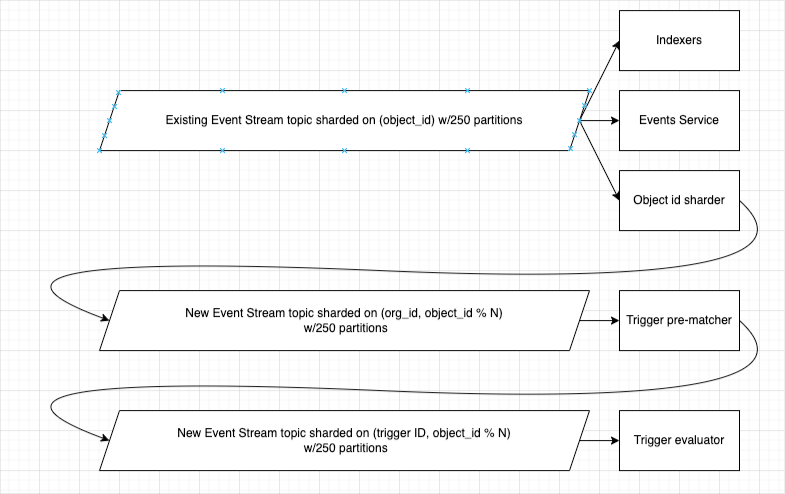
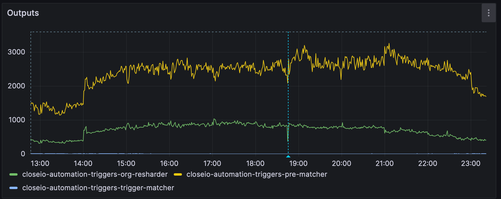

Ever wonder how great it would be if Close could perform actions in response to
actions on a Lead? Dive into today's post as we explore the "Triggers" feature -
our latest tool for smart automation and instant reactions to status changes and
more.

Our customers often seek automation for their sales processes. For quite some
time, we have offered a useful tool called "Sequences". You enroll a Contact in
a Sequence, and Close sends emails to your Contact according to a set schedule
and reminds you to make a call at a particular time. This works well, but to
benefit from it, you need to individually enroll people in it - and that’s a
manual process. Although it can be done in bulk, you still have to remember to
do it daily for new Leads.

In an effort to automate those remaining manual tasks, some customers have
adopted third-party tools such as Zapier. Despite Close offering one of the most
comprehensive sets of specific actions within Zapier, the added expense may not
appeal to everyone. And sometimes unexpected issues occur in the integration
between two different products. Zapier is an effective tool for integrating
other products, like sending a contract through DocuSign, but it can be clumsy
and error-prone when both sides of the integration are Close itself.

To make things more reliable, functional, and efficient in Close, we've
introduced the Triggers feature into our Sequences.

Before diving into the technical details, let's consider how our customers use
this feature.

# Overview

Triggers are defined by the conditions a Lead or Contact must meet. When a Lead
or Contact starts matching those conditions, the trigger activates (engineers
say the trigger “fires”) and performs a defined action. For now, the primary
action you can execute is enrolling the matched Contact in a Sequence. In the
future, we plan to add more actions, such as assigning a Lead to a user.

For instance, we may want to send all new Customers a welcome email. For this,
we set up a Sequence with a trigger that has a "status: Customer" condition and
is programmed to send an email using a Welcome template.

Now, when a Lead transitions from a Qualified status to a Customer status, the
trigger will fire, automatically enrolling the Lead in the Sequence and
prompting the welcome email to be sent. This eliminates the need for manual
intervention and guarantees that every new customer receives a consistent,
timely welcome message.

In the first iteration, we will only reveal Lead Status as a condition. However,
the underlying implementation can support more complex conditions. In future
iterations, you will be able to set Triggers for various conditions, such as
Lead status, address, user or group assignments, and custom fields. You could
also combine conditions with AND and OR, and use information from multiple
related objects simultaneously, such as a Lead and a Contact. This will allow
you to create highly targeted and personalized automation based on your distinct
sales process.

Alright, that's enough sales talk. Let's dive into the fun part: implementation!

# Implementation

Creating a scalable and flexible feature that detects arbitrary changes across
millions of objects simultaneously is a daunting task. This complexity is
significantly amplified considering that more than 1000 changes per second could
be happening to these objects during peak hours of activity. But nevertheless,
we can make it happen by relying on certain systems that are already set up at
Close. Here's a review of what we had before we started developing triggers:

## Event Log

Any change in Close generates an [Event](/posts/event-log/). These Events are
then processed through Kafka, a message streaming platform, which enables the
decoupling of systems and ensures reliable message handling while keeping the
routine app operation fast and efficient.

The event log's standout feature is that it provides both present and past data.
This allows us to respond to specific changes and trigger actions accordingly.
This is a simplified example of how a Note `updated` event works:

```json
{
  "action": "updated",
  "changed_fields": ["note"],
  "data": {
    "_type": "Note",
    "date_created": "2016-10-19T12:22:10.433000+00:00",
    "date_updated": "2016-10-20T10:00:00.000000+00:00",
    "id": "acti_4LNDQk2uhg7t8fGUWPyHX7cpCVH9PJtCyCssXFcao3e",
    "lead_id": "lead_sHR5sxie4dKOBkODA2flGciHen2c91YEpvTPt8x1NU0",
    "note": "My note."
  },
  "previous_data": {
    "note": "Previous note contents.",
    "date_updated": "2016-10-19T12:22:10.433000+00:00"
  },
  "id": "ev_17VaZdcdnsMNyWY9ZJnjph",
  "object_id": "acti_4LNDQk2uhg7t8fGUWPyHX7cpCVH9PJtCyCssXFcao3e",
  "object_type": "note"
}
```

In this example, you can see that the event contains both the current note text
and its previous version before the update. This is crucial because we want to
detect _changes_ and not just trigger the same action over and over with every
event.

## Search & Filtering Queries

At Close, we have a system that enables users to indicate arbitrary conditions -
it’s used for the Lead and Contact filtering pages and
[Smart Views](https://developer.close.com/resources/advanced-filtering/). Before
triggers, these queries were only used to efficiently retrieve objects and
reports from ElasticSearch. Using the same concept to define Trigger criteria
brings several benefits:

- We already have well-defined internal representations for conditions that have
  been thoroughly tested.
- An API format for exchanging those queries between the backend and the
  frontend components already exists, is documented, and engineers know how to
  use it.
- There's an existing UI for putting together queries on the Lead/Contact
  filtering pages. Even though it may take additional effort to transfer it to
  the Triggers composer, it's still much easier than designing and developing a
  new one from scratch.

Here's an example of a query that describes Leads in a certain status:

```json
{
  "type": "and",
  "queries": [
    {
      "type": "object_type",
      "negate": false,
      "object_type": "lead"
    },
    {
      "type": "field_condition",
      "field": {
        "type": "regular_field",
        "field_name": "status_id",
        "object_type": "lead"
      },
      "condition": {
        "type": "reference",
        "object_ids": ["stat_CfGgUWLujtq24fiLBMcSAO1KMr74F8LYt6q71E2HqTd"],
        "reference_type": "status.lead"
      }
    }
  ]
}
```

## 1+1 > 2, or How to tie two systems together and get something more out of it

The system is often more than just the sum of its parts. When you define a query
structure, you also need a way to match that query against the event log. At
first glance, this might seem elementary, but there's a lot of complexity
involved.

### Query Type Support

The first aspect is the query type and field support - it varies between
ElasticSearch-based Filtering and Triggers.

One such difference is text matching. ElasticSearch performs intricate
unicode-aware tokenization of both input strings and queries. Sadly, we can't
easily replicate this, and it's not feasible to send a request to ElasticSearch
with every event due to the sheer volume of events we must process. So, for now,
we've limited triggers functionality to only exact lowercase matches.

Another example of this differentiation is in matching relative date queries,
for instance, Leads that were created yesterday. The problem with these is that
when the Lead begins matching (the next day), there might not be an event to
indicate the transition to match the "created yesterday" condition - there might
not be any events at all for these Leads!

A third example of this distinction involves "computed fields". Our indexing
infrastructure continuously maintains derived summary fields based on relevant
data. Fields like "call count" on a Lead require additional processing and
storage to keep updated, and since we have at least hundreds of these fields,
doing it for every update isn’t feasible; hence we bulk and slightly delay these
in indexing, while prioritizing the more critical basic field updates. These
additional computed fields are not included in base events, so we had to exclude
these fields from triggers.

For these reasons, we create a new TriggerQuery structure from the standard
Query internally. This TriggerQuery is more suitable for caching and matching
individual events as they contain all the context (such as custom field
definitions and group-to-user mappings) embedded in it. The derivation process
is not reversible, and if an input Query is incompatible with Triggers, the
conversion procedure will return an error instead.

Here's an internal representation of a TriggerQuery equivalent to the one above:

```python
BooleanTriggerQuery(
    op=<BooleanOperator.And: 'and'>,
    queries=frozenset({
        TypeTriggerQuery(type=SearchableType.Lead),
        MatchReferenceTriggerQuery(
            field=PredefinedField.StatusId,
            values=frozenset({'stat_CfGgUWLujtq24fiLBMcSAO1KMr74F8LYt6q71E2HqTd'})
        )
    })
)
```

On the API level, the exact same Query structure is used, so we can extend
support for more query types in the future without breaking backward
compatibility and reworking what was already built.

### Query Evaluation

The second aspect involves evaluating the query against the event data. The
tricky part is that we don’t merely match against the current state; we also aim
to detect _changes_ and accommodate other cases like object creation. For that,
we follow a general rule:

“The trigger fires only if the object didn’t match before the event AND it
matches after the event”

Let's stick with the original example of a "status: Customer" trigger and
consider a few example events:

- Scenario A:
  - Before: Qualified, after: Customer
  - Trigger fires 🎉
  - Explanation: before state didn’t match the condition, and after state
    matches.
- Scenario B:
  - Before: Qualified, after: Lost
  - Trigger does not fire 🙅
  - Explanation: neither states match
- Scenario C:
  - Before: Customer, after: Customer - some other field was changed on the same
    object
  - Trigger does not fire 🙅
  - Explanation: even though both states match the condition, the rule requires
    before state to NOT match
- Scenario D:
  - Before: Customer, after: Cancelled
  - Trigger does not fire 🙅
  - Explanation: this is literally the opposite of what the rule says - before
    state matches but after state does not match.
- Scenario E:
  - Action: deleted
  - Trigger does not fire 🙅
  - Explanation: a deleted object can’t match conditions - it doesn’t exist!
- Scenario F:
  - Action: created, status: Customer
  - Trigger fires 🎉
  - Explanation: state after the event obviously matches, but what’s the “state
    before” for the rule above? The object didn’t exist before so it couldn’t
    match, which follows the rule, and the trigger fires.

If you analyze the scenarios above carefully, you'll find that a single general
rule effectively handles all the create, update, and delete scenarios in a
manner consistent with what users expect from a triggering system. This was an
important design consideration, as it enables multiple pathways an object could
take to arrive at a specific state without needing to explicitly articulate what
sequence of events Lead to the final state.

### Query Evaluation with Related Objects

Triggers will also support conditions that span multiple related objects.
Consider this slightly more complex use-case: I’d like to send a different
welcome email to CEOs of new Customers. This implies a condition on both the
Lead status and the Contact title. The tricky part is that Leads and Contacts
are separate objects, and events for one of them doesn’t include data for the
other.

To handle these types of conditions, we have to _partially_ evaluate the
condition with the data we have from the event, which can result in one of three
outcomes:

- the condition matches irrespective of related objects
- the condition doesn’t match irrespective of related objects
- the outcome depends on the data from related objects

The first two outcomes are more or less straightforward, but the third one
implies we need to fetch the related object (or multiple objects) from the
primary datastore, extract the data in a format suitable for matching against
conditions, and then re-evaluate the remainder of the query again until we get a
definitive yes or no.

## 1+1+1+1+…, or Scaling Challenges

Now that we’ve seen how we can match a single event, it’s time to scale it up to
handle production workloads.

Our goal is to be able to support millions of triggers running simultaneously on
an event stream of tens of thousands of events per second. This accounts for a
fair amount of future growth so we don’t have to redesign a complex system in
the next 5+ years.

A naive solution — to merely check every event against every trigger condition —
doesn't scale particularly well. Note that we instruct Kafka to partition (or
shard) events by object ID. That doesn’t include organization ID, so even if you
have multiple workers processing events, each of them has to be aware of every
trigger at all times. With a growing number of customers (and customers also
growing in size), this approach breaks down pretty quickly - the memory overhead
for each process is too large.

Another naive approach is to simply have a database of triggers with an index
over organization ID, and query for triggers with every event. This approach
works, however, it puts a very low cap on the throughput of an individual worker
process. Imagine a query to a database takes 1 millisecond (and that’s probably
too optimistic for a decently sized table even with an index): a single worker
can perform at most 1000 of such queries in a second. And we haven’t done any of
the actual event matching yet! The database can also become a bottleneck and a
single point of failure very quickly.

Naturally, we want to re-shard the event stream to use the organization ID as
the key, so all events for a particular organization arrive at the same worker.
This would allow any worker to only hold a subset of triggers in memory - those
that belong to the assigned partition of organization IDs. It would periodically
refresh the list of active triggers from the database. But that can happen
lazily and we could still process incoming events if the triggers database goes
down.

Now, here’s a problem with this setup: if a very large organization gets
assigned to a worker, it becomes a hotspot and has to process significantly more
events than an average worker does. Hot partitions like these tend to lag, and
the situation often snowballs into larger problems. We can mitigate the hotspot
issue to a certain extent with two tricks:

1. Augment the partition key with a portion of the object ID. Essentially, the
   partition key = `organization_id + hash(object_id) % WORKERS_PER_ORG` where
   `WORKERS_PER_ORG` is a small fixed number = 4 in our case. This means the
   workload of any particular organization is shared between 4 workers (out of
   many more), which still limits the amount of data we have to hold per
   organization, but spreads the load to an acceptable level.
2. Minimize the amount of work that needs to be done for every event. In our
   case, it makes sense to just match an event to a potential trigger by object
   type but delegate the actual evaluation to a separate processing stage. As a
   side effect, this reduces memory requirements, since we only need to hold a
   map of organization ID and object type to a trigger ID. To delegate the
   evaluation itself, we re-emit the event with the attached trigger ID into a
   separate Kafka topic. This time, the event is partitioned by
   `(object_id, trigger_id)` pair, distributing the load even further.

The next processing stage is where the actual evaluation of a trigger condition
against event data takes place. This was explained in detail above, but an
important step here is that events that actually matched a trigger condition are
re-emitted into yet another Kafka topic. This topic serves both as a short-term
audit log (we can debug what, when, and why caused a trigger to fire) and as a
buffer between evaluation and action execution.

Then the final stage is the execution of the actual action, like subscribing
someone to a Sequence. This usually comes in bursts and often requires
non-trivial IO, including waiting for locks, so it’s best to decouple it from
the event evaluation.

Here’s what the whole pipeline looks like:



## Kafka Exactly-Once Semantics

You may have noticed that a lot of the processing involves taking events from
one Kafka topic, doing some processing, and then putting the result back into
another topic. But what happens if the worker fails? Fortunately, Kafka offers a
range of tools to deal with failures.

First, we need to turn off auto-commit and acknowledge each event explicitly
after the processing is completed. This allows Kafka to resend events to a
different worker, should the current one fail.

Then we take advantage of
[Exactly-Once semantics](https://www.confluent.io/blog/exactly-once-semantics-are-possible-heres-how-apache-kafka-does-it/)
support to avoid situations when we already sent a processed event but failed
before acknowledging the original. The documentation for this feature is not
straightforward, and some pages offered slightly outdated guidance. We also had
to upgrade the Kafka client library to avoid crashes in certain scenarios. Since
3 of the 4 stages involve a very similar top-level processing loop, we extracted
it into a separate class that allows pluggable processing modules to be passed
in as python Callables.

## Architectural Dead Ends

What was described above was not the only path we explored. One of the options
we considered, but did not implement, was to poll ElasticSearch for changes
every couple of minutes. This option is appealing for its technical simplicity,
since it allows for offloading query evaluation to a different system. However,
it comes with some serious downsides, including high sustained load on an
already busy ElasticSearch cluster, elevated latency - the trigger detection
might depend on the polling interval, and the possibility of missing some
short-lived states that only exist for less than one polling interval.

Another option was a hybrid between pure polling and event matching. The
challenge with this one is synchronizing event processing in Triggers with a
long and complex indexing pipeline, which is further complicated by
ElasticSearch's refresh interval.

## Deployment

Good architecture means nothing if doesn't actually work in practice. We needed
to stress-test the system under conditions as close to realistic as possible.
Thanks to Kafka’s design, we were able to reuse the existing topic with event
data, and create many thousands of synthetic triggers based on criteria like
Lead status. Monitoring and metrics are crucial for understanding the dynamic
behavior of a system like this, so we used instrumentation heavily.



After some careful tuning, we were able to achieve the desired performance
goals, and we're confident it’s going to handle our customer's requirements
comfortably.

## Communication

Development of such a complex system is difficult not only from an engineering
aspect but also from a project management standpoint. Multiple iterations of
design and outstanding levels of communication between Engineers, Designers, and
Product Managers, were necessary to establish shared understanding of what
triggers can and cannot do. They were needed to figure out how they are supposed
to work in different scenarios on both technical and conceptual levels. Defining
them in code and APIs and presenting them to users in a way that’s not confusing
but at the same time powerful and flexible required great synergy. At this
point, I’d like to thank the entire team who worked together on this project.
This is truly a team effort.

# Conclusion

Over the span of a few months, we worked to develop a scalable and performant
backend for Triggers. As of now, our primary focus remains to expose the
powerful capabilities to users in a friendly way. This was a challenging and
enjoyable project, and it will deliver immense value to customers at Close by
automating tedious work and allowing them to focus on what genuinely matters -
effective communication. But there's always more to do. Soon, we're looking to
make it even easier to use and handle more use-cases. If the idea of working on
projects like this excites you, guess what?
[We're hiring! Come join us and let’s keep creating innovative tools that benefit businesses worldwide.](https://jobs.close.com/)
