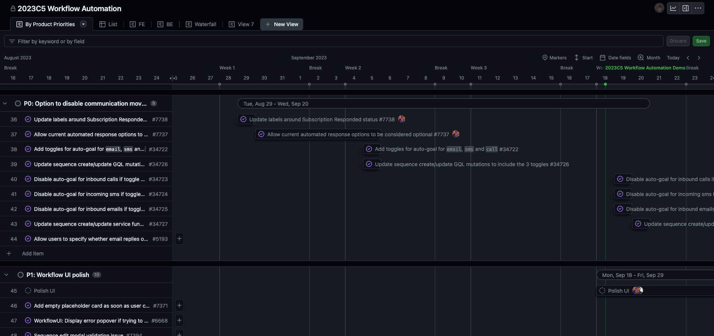

At Close, we want to ensure that every feature we work on offers real value to our users. The path we follow from conceptualizing a feature to its development and ultimately its release has evolved over the years. A couple of years ago, we adopted [Basecamp's Shape Up method](https://basecamp.com/shapeup) and refined this approach to suit our needs. Let me give you a high-level overview of how the process looks from an engineer's perspective.

## The 6-Cycle Year: Our Development Calendar

We divide our year into six cycles, each lasting six or seven weeks. For instance, a cycle might be a week longer if holidays fall within it, or if we have an all-team retreat planned. Between these cycles, we have two "gap weeks".

During cycle weeks, feature development takes place. The time is fixed, but the scope of the project remains flexible. We prefix cycle numbers with the current year for easier future reference: 2023C1, 2023C2, and so on.

Gap weeks offer a less rigid structure. If we're not preparing for future cycles, this period allows for personal projects, bug fixes, refining our software stack, or even drafting blog posts like this one 😉

This is how our development calendar looked for 2023:

<table>
    <thead>
        <tr>
            <th>Name</th>
            <th>Date</th>
            <th>Length</th>
        </tr>
    </thead>
    <tbody>
        <tr>
            <td>Gap</td>
            <td>Jan 3 – Jan 6, 2023</td>
            <td>1 week</td>
        </tr>
        <tr>
            <td>2023C1</td>
            <td>Jan 9 – Feb 17, 2023</td>
            <td>6 weeks</td>
        </tr>
        <tr>
            <td>Gap</td>
            <td>Feb 20 – Mar 3, 2023</td>
            <td>2 weeks</td>
        </tr>
        <tr>
            <td>2023C2</td>
            <td>Mar 6 – Apr 14, 2023</td>
            <td>6 weeks</td>
        </tr>
        <tr>
            <td>Gap</td>
            <td>Apr 17 – Apr 28, 2023</td>
            <td>2 weeks</td>
        </tr>
        <tr>
            <td>2023C3</td>
            <td>May 1 – Jun 16, 2023</td>
            <td>7 weeks (Team Retreat)</td>
        </tr>
        <tr>
            <td>Gap</td>
            <td>Jun 19 – Jun 30, 2023</td>
            <td>2 weeks</td>
        </tr>
        <tr>
            <td>2023C4</td>
            <td>Jul 3 – Aug 11, 2023</td>
            <td>6 weeks</td>
        </tr>
        <tr>
            <td>Gap</td>
            <td>Aug 14 – Aug 25, 2023</td>
            <td>2 weeks</td>
        </tr>
        <tr>
            <td>2023C5</td>
            <td>Aug 28 – Oct 6, 2023</td>
            <td>6 weeks</td>
        </tr>
        <tr>
            <td>Gap</td>
            <td>Oct 9 – Oct 20, 2023</td>
            <td>2 weeks</td>
        </tr>
        <tr>
            <td>2023C6</td>
            <td>Oct 23 – Dec 8, 2023</td>
            <td>7 weeks (Thanksgiving)</td>
        </tr>
        <tr>
            <td>Gap</td>
            <td>Dec 11 – Dec 22, 2023</td>
            <td>2 weeks</td>
        </tr>
    </tbody>
</table>

## The Shaping Process

Each feature's journey begins with a "pitch doc" in Dropbox Paper. Here, we identify and argue the potential value a feature can bring, asking the essential question: is this feature worth our next 6+ weeks of work? If so, in what form? What are the most crucial parts that will provide the most significant value to our customers?

This document contains more than just text. We incorporate basic mockups, giving everyone a clearer picture of our vision.

While anyone on the team can start the pitch doc, currently, at Close, product managers are leading in this area. The sources of inspiration for our pitch docs and how we gather insights is a topic for another blog post.

This is a structure the pitch doc might have:

1. **Problem definition**
    - The raw idea, or something we’ve seen that motivates us to work on this. May consist of a single specific story that shows why the status quo doesn’t work.
2. **Use cases / Customer research**
    - Real life examples of how this will make our customer’s life easier.
    - Links to the docs with the raw User/Customer data (analytics, surveys, interviews, etc.)
3. **User/Customer segment mostly impacted by the problem**
    - What type of customers does it impact the most?
4. **Rationale**
    - Why do we want to take care of this problem/idea?
    - How much time do we want to spend and how does that constrain the solution?
5. **Proposed Solution**
    - High-level overview
    - Lo-fi mockups
    - Rabbit holes — details about the solution worth calling out to avoid problems
    - Engineering effort
6. **Goal metrics**
    - E.g. 20% of workflow organizations using a customized schedule

To estimate engineering effort (at a preliminary stage), we use the t-shirt sizes terminology:
- `XS` — Minimal to no effort required.
- `S` — Takes one engineer less than one cycle to complete.
- `M` — Takes one engineer exactly one cycle to complete.
- `L` — Takes two engineers one cycle to complete.
- `XL` — Requires multiple engineers for multiple cycles.

If a project's estimated effort approaches L or XL, we'll seek ways to reduce its scope to ensure manageability. While this wasn't always our method during the early stages of transitioning to this planning strategy, our current goal is to keep projects within a single-cycle duration. Even when planning for larger features or product areas, we structure the work within a cycle such that we consistently deliver significant value to our customers in each cycle.

## The Prep for Development

The pitch doc serves as the foundation for our shaping process. At this stage, engineers help in evaluating the feasibility and cost of the proposed feature. Their inputs, combined with the product team's insights, help finalize the project's scope.

We give this process the time it deserves, holding focused sync meetings within a broader, yet still as small team as possible: usually 1 or 2 developers, a product manager, and a designer. During the shaping process, we might have a couple of these syncs spread across multiple weeks. Between the syncs we communicate asynchronously and work on adding more details to the project. The product specification slowly gets created. 

The pitch doc and product specification then sets the base for development speccing. Our aim is to have this document “Development Spec” (these are usually two separate — for backend and frontend work) ready at least two weeks before the cycle begins, ensuring we're all on the same page regarding delivery expectations.

So a high level process is that the Pitch Doc is a base for Product Spec, which is then a base for Development Spec.

The Product Spec is usually split into feature sections with a priority assigned to each feature (form P0 — critical, without finishing it project doesn’t make sense to P3 — low, a nice to have). This is how these sections looked high-level for our 2023C5 Workflow Automation project:

- **P0: Change workflow UI**
    - [mockups for the expected changes]
- **P0: Remove current outbound auto-pause logic (30 second rule)**
    - [description of the business logic changes]
- **P0: Show an indication on calls that were made as part of a Workflow**
    - [mockups of the design changes]
    - [description of the business logic changes]
- *More P0s…*
- **P1: Allow completed calls to mark the subscription as responded while editing afterwards**
    - [description of the business logic changes]
- **P2: When steps are skipped, show them in the Workflow preview when viewing the subscription history.**
    - [description of the business logic changes]
- *More P2s and P3s…*

Finally, when a developer (usually the project lead) works on the development specification they'll likely use these production priority sections as guidance. Recently we’ve started to experiment with using Github Projects for the whole development specification, but a simple Dropbox Paper document has worked quite well for us so far. 

This is how Github Project looked like for 2023C5 Workflow Automation project. The issues are grouped in product priority groups taken from the Product Spec.

## Forming the Cycle Team

Every feature has its dedicated team, typically consisting of 1-3 developers. For larger projects, this number might go up to five. This team also includes a product manager, and a designer. For each cycle project we select one developer who becomes the project lead. The project lead:

- confirms we have specced everything we need to start development process
- ensures we stay on track with the plan, or changes it according to the situation (having this in mind: fixed time, flexible scope)
- makes sure we keep our focus on the project goals, helping prioritizing the work
- communicates the state of the project on a weekly basis to the rest of the team (in the form of weekly summaries)
- helps planning feature releases so they are exposed to the users as quickly as possible (coordinating beta periods with product managers, planning when a feature will be shipped publicly)
- presents state of the project during mid-cycle demos (more on that later)
- organizes and leads a “retro” meeting at the end of the cycle (more on that later)
- presents the final results to the whole Close team in a form of pre-recorded demo

## The Buffer Week: Our Safety Net

Our cycles are intentionally designed to leave the last week without any planned work — we call it the "buffer week". This week allows us to fine-tune features, address bugs, and add finishing touches. While our planning has become more precise over time, having this buffer ensures we can handle unforeseen hiccups.

## Weekly Updates: Keeping Everyone in the Loop

Transparency is vital. The project lead provides weekly summaries on progress, future goals, and any changes to the initial plan, keeping the entire team informed. Just to underline this: changing the plan is perfectly fine — again, fixed time, flexible scope. 

All updates from all cycle projects are added to a running Weekly Updates doc. This doc is updated weekly by Project Leads by 10am ET before the Product/Engineering meeting to brief the team and allow for questions or discussion on our Product/Engineering Sync.

Here is an example of how our weekly update for a 2023C5 Workflow Automation project looked in week 5 of the cycle:

**Legend:**

✅ = Things are good, nothing to see here.

❗= I’m a bit concerned about how things are going, please pay attention.

- **✅ Workflow Automation**
  - Customizable Schedules has shipped.
  - We’ve shipped a bunch of UI improvements:
    - Added empty placeholder with newly added Workflow steps
    - Added an indicator of an unsaved Workflow
    - Better error visibility in Workflows
    - Fixed name edit validation issues
    - Fixed “any time” checkbox being stretched
  - We have an initial E2E test that we’ll be finishing this week.
  - As Alec is back, this week we’re focusing on finishing Workflow previews. As mentioned before, it’ll likely ship during the gap weeks. Apart from that, we are doing planned UI improvements so that by the EOW we leave the Workflows in a good shape.

## Mid-Cycle Demos: A Progress Check

Midway through the cycle, we host demos showcasing what's been developed so far. While these demos might not always reflect the finished product, they're a great checkpoint ensuring we're on the right path.

## Post-Cycle Reflection: The Retro Sync

Once a cycle finishes, each cycle-team gathers for a retrospective meeting. It’s a time for giving kudos and saying thank you, talking about what we’ve achieved and discussing potential improvements to our product development process. Summarized insights from this session are then shared with the entire engineering team and presented by the project lead during the Product/Engineering Sync.

This is an outline of a template that we use for creating Retro document:

- **Participants**
- **What Went Well/Thanks/Kudos**
- **Problems/Observations**
- **Alternate Reality**
    - *Given everything we know now, would we have done anything differently?*
- **Summary/Learnings**
    - *Project lead summarizes the project went after the retro, especially include any points that are worth sharing company-wide.*

## Starting Anew: The Product Sync Meeting

As we start the next cycle, we organize a company-wide product sync meeting. This optional yet popular meeting is where we show summaries of the cycle project, play short videos (demos) of the developed features and outline plans for the upcoming cycle.

## Outro

I hope that this glimpse into our feature development process has provided insights you might find valuable in your own project. How does your feature development process compare? Are there any tools and planning strategies you would recommend? Hit me up on X [@bartgryszko](https://twitter.com/bartgryszko).

If you want to join our Engineering team, check out our open positions at https://making.close.com/jobs/