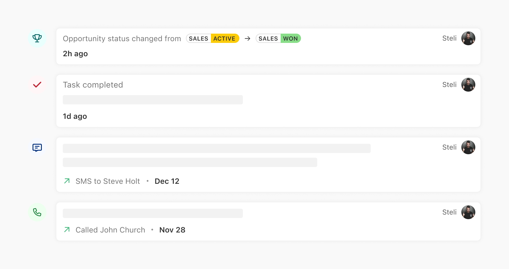
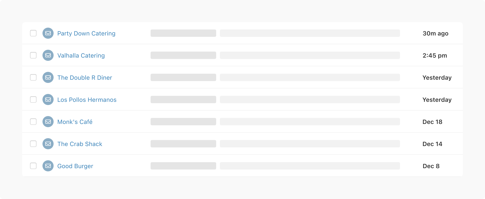

Time. [Is it real?](https://www.youtube.com/watch?v=qf_OGB6zazU) Who really knows.

Regardless, it shows up in our app a lot. So, we've spent a fair amount of time thinking about...time. 

Specifically, timestamps. We use timestamps on all activities logged in the app: Things like when a note was written, when an email was received, when a call was made, etc.

Why put much thought into this? Well, we have a number of views with collections of messages (Inbox) or activities (Lead page) where this information is displayed repeatedly.

Our main goals are:
- Don't make the user think
- Only display what's necessary (and omit the rest)

## General Formatting
- Use abbreviations for months
  - `Oct`, `Nov`, `Dec`
- Omit periods in abbreviations
  - `Oct 12`,  `7:28 pm`
- Lowercase am and pm (for 12-hour clock)
  -  `6:38 pm`
- Show trailing minutes at the top of the hour (to avoid any ambiguity)
  -  `9:00 pm`
- 12/24 hour display should determined by browser/OS/localization
  - `1:34 pm` = `13:34`

You can see how the formatted timestamp is more readable than a version that contains numerals and periods for abbreviations.
- `Dec 20, 2023 at 12:20 pm`
- `12/20/2023 at 12:20 p.m.`

### Activities & Messages
For our activities and messages, we use a mix of relative and absolute timestamps. 

#### Activities

For recent activities on the Lead page, we use relative timestamps because they quickly communicate how recent something is.

 

- `Now`
- `A few seconds ago`
- `Less than 1m ago`
- `1m ago`
- `59m ago`
- `1h ago`
- `Yesterday`
- `1d ago`
- `7d ago`

After 7 days, we switch to absolute timestamps: `Oct 21`. 

If the timestamp is within the same year, we omit the year.

#### Messages

For messages in our Inbox view, the absolute timestamp is more critical after the first hour, as it helps users track and reference conversations more precisely.

 

- Relative timestamps for messages sent or received within the past hour
  - `17m ago`
- Past the first hour, we switch to absolute times
  - `12:38 pm`
- For yesterday we display
  - `Yesterday` with tooltip: `Mon, Dec 18, 2023 at 5:10 pm CST`
- Anything before yesterday we display as an absolute date
  - `Dec 16`

### Future 

Future items include things like upcoming meetings or scheduled messages.

- `Tomorrow`
- `in 2d`
- `in 6d`

Outside of 7 days, display the month and day: `Oct 21`

## Tooltips

We like to include a tooltip on all timestamps with the full date, time, and time zone: `Oct 21, 2015 at 7:28 pm (CST)`

## Internationalization

The [Intl.DateTimeFormat.prototype.format()](https://developer.mozilla.org/en-US/docs/Web/JavaScript/Reference/Global_Objects/Intl/DateTimeFormat/format) method formats a date according to the locale and formatting options of this Intl.DateTimeFormat object.

Alternatively, [Luxon](https://moment.github.io/luxon/#/) is a Javascript library with native time zone and Intl support.